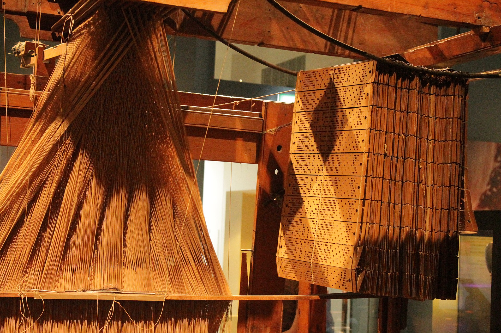
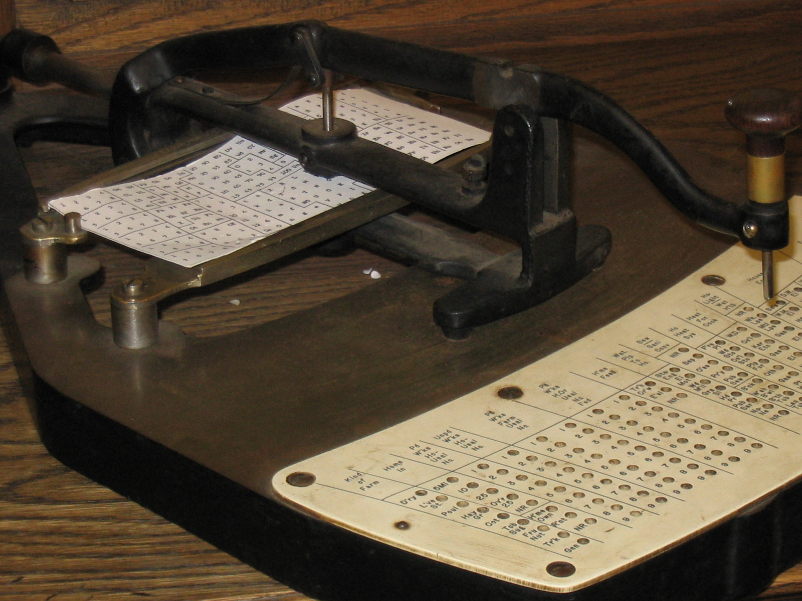
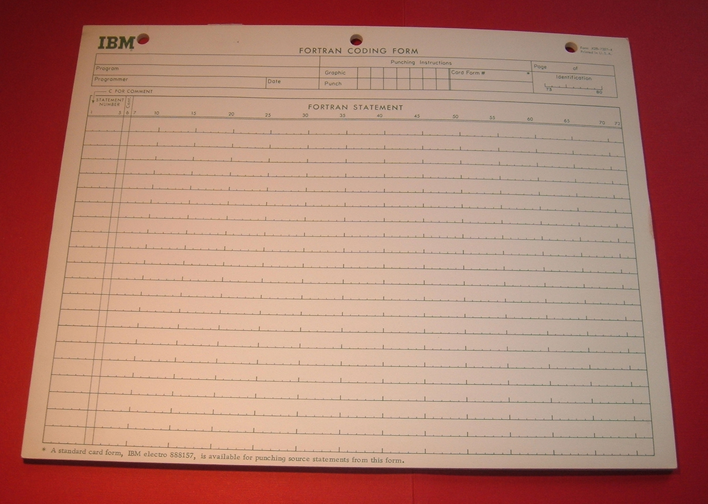
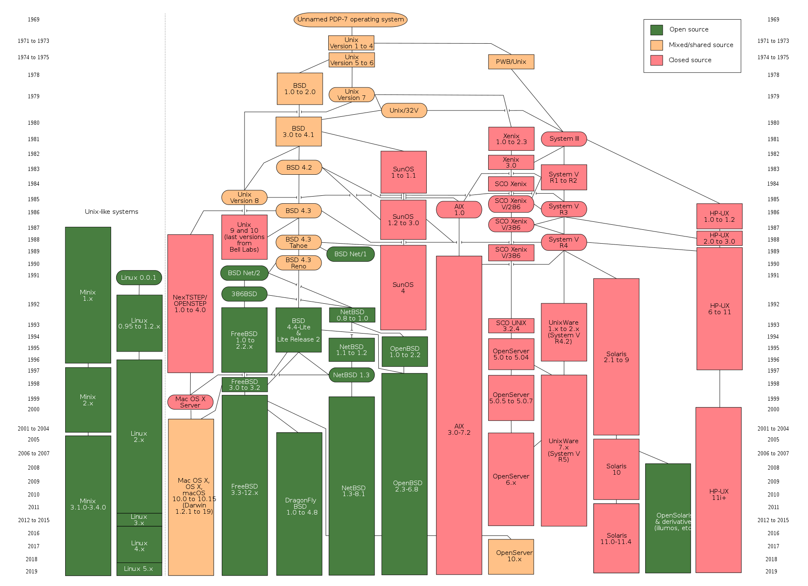

## 编程语言的前世今生

### 1940 前 混沌时期

1940 前，第一台电子计算机还没被制造出来，这个时候所说的**编程语言**是一种**控制机器自动运行/执行**的代码。举几个例子：

* 雅卡尔织布机

  **雅卡尔织布机** 是 **约瑟夫·玛丽·雅卡尔** 于**1804年**发明的。工作人员使用雅卡尔织布机前首先设计需要编织的图案，并根据设计以及相应规则在**打孔卡上打孔**，随后将**打孔卡**放入雅卡尔织布机，雅卡尔织布机**根据打孔卡孔的有无**来控制经线与纬线的上下关系，以达到编织纺织品不同花样的目的。

  这和最初计算机的操作模式是非常类似的。

  (此图右侧为打孔卡)

  

* **赫尔曼·何乐礼**在观察列车长对乘客票根在特定位置打洞的方式后，意识到他可以把信息编码记载到打孔卡上，随后根据这项发现使用打孔卡来编码并纪录1890年的人口统计资料。

  下图为霍列瑞斯式的打孔机，用于 1890 年人口普查

  

### 1940 开天辟地

世界上第一台电子计算机，应该是**阿塔纳索夫-贝瑞计算机**，它使用了真空管计算器，二进制数值，有可复用内存。程序员在有限的速度及存储器容量限制之下，撰写人工调整过的**汇编语言**程序。（注意，这个时候还**没有键盘**，所有的**代码**都是打在**打孔卡**上的）

> 我们的教材可能说 **世界上第一台电子计算机是ENIAC**。这其实涉及到了一个历史上有趣的故事：https://www.bilibili.com/read/cv5034020

汇编语言是一种低级语言。在不同的设备中，汇编语言对应着不同的机器语言**指令集**。一种汇编语言专用于某种计算机系统结构，**不能**在不同系统平台之间**移植**。

> 这里的高级和低级不是对语言优劣划分的，而是指语言的层次。低级语言更贴近计算机底层和硬件，而高级语言，如 c 语言，更贴近用户。

很快，人们就发现到使用汇编语言的这种撰写方式需要花费大量的脑力而且很容易出错。

### 1950 - 1960 探索

有三个现代编程语言于1950年代被设计出来，这三者所派生的语言直到今日仍旧广泛地被采用：（未列出全部）

- [FORTRAN](https://zh.wikipedia.org/wiki/FORTRAN) (1955)，名称取自"**FOR**mula **TRAN**slator"(公式翻译器)，由**约翰·巴科斯**等人所发明
- [LISP](https://zh.wikipedia.org/wiki/LISP)，名称取自"**LIS**t **P**rocessor"(列表处理器)，由**约翰·麦卡锡**等人所发明
- [COBOL](https://zh.wikipedia.org/wiki/COBOL)，名称取自"**CO**mmon **B**usiness **O**riented **L**anguage"(通用商业导向语言)，由被**葛丽丝·霍普**深刻影响的**Short Range Committee**所发明

这里我们可以展开说说 **FORTRAN**：https://www.gmw.cn/01gmrb/2005-11/17/content_332435.htm

1953年12月，IBM公司工程师**约翰·巴科斯**深深体会编写程序很困难，写了一份备忘录给董事长**斯伯特·赫德**，建议为IBM704系统设计一种**接近自然语言的编程语言**以提升开发效率。当时IBM公司的顾问**冯·诺伊曼**（当时50岁）强烈反对，因为他认为不切实际而且根本不必要，他认为写汇编/机器语言完全够了。不过**赫德**还是批准了这项计划。

**FORTRAN** 是成功的，今天编程语言中的一些要素，例如标识符、数组、表达式、赋值语句、条件语句、循环语句等当时已经提出来了。最后**巴科斯**于1977年度计算机界最高奖图灵奖。

#### 所以权威未必总是对的，坚持自己想做的，follow your heart！✊

这个时候还是没有键盘，下图是 FORTRAN 的代码表，程序员准备将上面写的代码用打卡机转录到卡片上。

### 1960 - 1978 确立基础范型

1960年代晚期至1970年代晚期的期间中，编程语言的发展也有了重大的成果。大多数现在所使用的主要[语言范型](https://zh.wikipedia.org/wiki/编程范型)都是在这段期间中发明的：（未列出全部）

- **[Simula](https://zh.wikipedia.org/wiki/Simula)**，于1960年代晚期由**奈加特**与**达尔**以Algol 60超集合的方式发展，同时也是**第一个**设计支持**面向对象**进行开发的编程语言。
- **[C](https://zh.wikipedia.org/wiki/C語言)**，于1969至1973年间由**贝尔实验室**的研究人员**丹尼斯·里奇**与**肯·汤普森**所开发，是一种早期的**系统程序设计**语言。下面展开说。
- **[SQL](https://zh.wikipedia.org/wiki/SQL)** 1978年，起先只是一种查询语言，扩展之后也具备了程序的结构。

#### 不得不提的两个人：里奇 和 汤普森。

下图左为汤普森，右为里奇，都是大胡子🧔

 

说回 1940 年第一代电子计算机问世，那时候的计算机是纯硬件，没有操作系统。程序员通过写汇编直接操纵硬件来和计算机打交道。

直到 1950-1960 年代，有了**批处理系统**。（FORTRAN 运行的 IBM704 应该是有操作系统的）

再到后来的 1964 年，**贝尔实验室**和麻省理工学院、通用电气公司合作开发一个叫 **Multics** 的操作系统。这个操作系统的目标是：多用户、多任务、多层次。不过很可惜，5年后，这个系统开发得过于缓慢，贝尔实验室**退出**了这个项目的开发。

虽然计划终止，但有几台GE-645还留在贝尔实验室。汤普森就继续在GE-645上开发软件。（这个叫借用公家资源）他写了一个程序语言Bon，编写了一个**太空旅行游戏**。经过实际运行后，他发现游戏速度很慢而且耗费昂贵，每次运行会花费75美元。后来GE-645被搬走后，汤普森在实验室中找到几台没人用的PDP-7。在里奇的帮助下，汤普森用PDP-7的汇编语言重写了这个游戏，并使其在 PDP-7上运行起来。这次经历加上Multics项目的经验，促使汤普逊开始在 PDP-7 上**研究如何开发操作系统**。

在团队合作下，Multics 的许多功能都被采纳和重新实现，最终做出了一个**分时多任务操作系统**，成为第一版UNIX。第一版UNIX是用**PDP-7汇编语言编写**的，一些应用是由叫做**B语言的解释型语言**和**汇编语言**混合编写的。在进行系统编程时**不够强大**，所以汤普逊和里奇对其进行了改造，并于1971年**共同发明了C语言**。1973年汤普逊和里奇**用C语言重写了Unix**，形成第三版 UNIX。在当时，为了实现最高效率，系统程序都是由汇编语言编写，所以汤普逊和里奇此举是**极具大胆创新和革命意义**的。**用C语言编写的Unix代码简洁紧凑、易移植、易读、易修改**，为此后Unix的发展奠定了坚实基础。（这个时候还没有windows）

所以 c 语言是在开发 unix 操作系统中诞生的，造个操作系统顺便写了个语言，太🐂🍺了。

下图为汤普森和里奇坐在 PDP-11 前工作的照片。 _and_Dennis_Ritchie_at_PDP-11_(2876612463).jpg)

之后 unix 发展出了不同分支，如图：

* https://zh.wikipedia.org/wiki/UNIX

### 1980 增强、模块、性能

这个年代没有产生新的语言种类，更多的是对上个时代的语言**强化**和**标准化**和**拓展**，将上个时代的发明构想进一步发扬光大。我们比较熟悉的就是[C++](https://zh.wikipedia.org/wiki/C%2B%2B)，它合并了面向对象以及系统程序设计。

### 1990 互联网时代

1990年代未见到有什么重大的创新，大多都是以前构想的**重组**或**变化**。这段期间主要的**目标**是**提升程序员的生产力**。许多"[快速应用程序开发](https://zh.wikipedia.org/wiki/快速應用程式開發)" (RAD) 语言也应运而生，这些语言大多都有相应的**集成开发环境**、**垃圾回收**等机制，且大多是先前语言的**派生语言**。这类型的语言也大多是**面向对象**的编程语言。

还有新推出的[脚本语言](https://zh.wikipedia.org/wiki/脚本语言)则比RAD语言。这种语言并非直接从其他语言派生，而且新的语法更加**开放地与功能契合**。虽然脚本语言比RAD语言来的更有生产力，但大多会有因为小程序较为简单，但是大型程序则难以使用脚本语言撰写并维护的顾虑。尽管如此，脚本语言还是网络层面的应用上大放异彩。

在这段期间被开发出来的重要语言包括有：

- 1991 - [Python](https://zh.wikipedia.org/wiki/Python) （ABC 和 LISP 的后继者）
- 1991 - [Visual Basic](https://zh.wikipedia.org/wiki/Visual_Basic) （微软开发，源于 BASIC 语言）
- 1993 - [Ruby](https://zh.wikipedia.org/wiki/Ruby) （日本松本行弘开发、Rails框架，以前 twitter 用 ruby 写的）
- 1993 - [Lua](https://zh.wikipedia.org/wiki/Lua) （脚本语言）
- 1995 - [Java](https://zh.wikipedia.org/wiki/Java)
- 1995 - [JavaScript](https://zh.wikipedia.org/wiki/JavaScript)
- 1995 - [PHP](https://zh.wikipedia.org/wiki/PHP)

### 2000 年至今

编程语言持续在学术及企业两个层面中发展进化，目前的一些趋势包含：

- 在语言中增加安全性与可靠性验证机制：额外的**堆栈检查**、**信息流控制**，以及**静态线程安全**。
- 以**组件为导向**的软件开发。
- **元编程**、**反射**或是访问**抽象语法树**。
- 更重视**分布式**及**移动式**的应用。
- 与**数据库的集成**，包含XML及关系数据库。
- 支持使用Unicode编写程序，所以源代码不会受到ASCII字符集的限制，而可以使用像是非拉丁语系的脚本或延伸标点符号。

2000 年后我们比较熟悉的语言有：

- 2001 - [C#](https://zh.wikipedia.org/wiki/C_Sharp)
- 2009 - [Go](https://zh.wikipedia.org/wiki/Go)
- 2014 - [Swift ](https://zh.wikipedia.org/wiki/Swift_(程式語言)) （开发ios）

这里还要提及一个人，还是**汤普森**！

**汤普森**于 2006 年入职**谷歌**，此时他**63**岁（现在还在世，2021.10.22）。然后2007年，和几个人一起设计了Go语言，于 2009 年正式上线。

#### 所以说，活到老学到老，人生这么长，你可以年少有为，也可以大器晚成。

曾经有人问过汤普森为什么学编程：

#### He said:"I was always fascinated with logic and even in grade school I'd work on arithmetic problems in binary, stuff like that. Just because I was fascinated."

希望大家都能好好学习，找到自己着迷的东西，为社会做出贡献。😈

### 参考

* https://en.wikipedia.org/wiki/History_of_programming_languages
* https://www.gmw.cn/01gmrb/2005-11/17/content_332435.htm
* https://www.bilibili.com/read/cv5034020