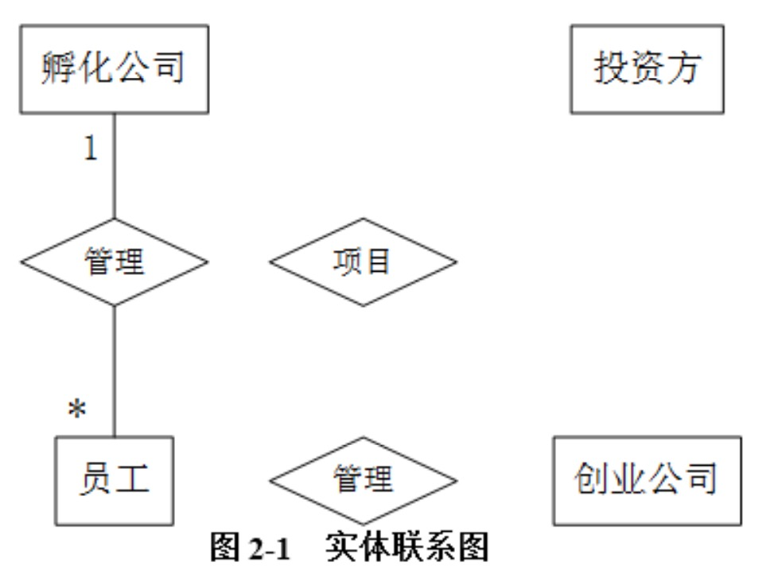
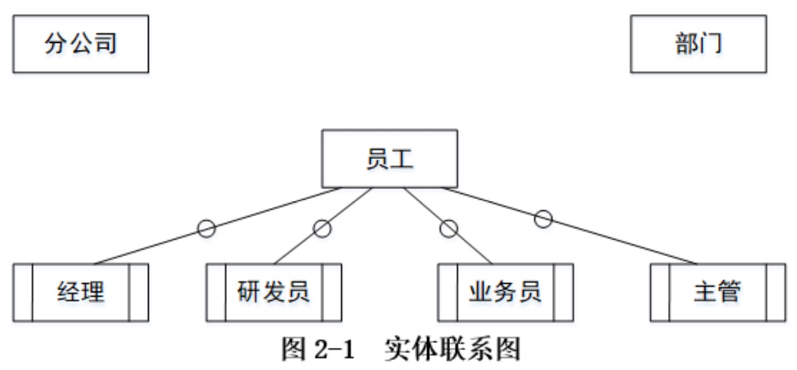

## ER图练习题

### 题目一

阅读下列说明，回答问题 1 至问题 3，将解答填入答题纸的对应栏内。 

#### 【说明】

某创业孵化基地管理若干孵化公司和创业公司，为规范管理创业项目投资业务，需要 开发一个信息系统。请根据下述需求描述完成该系统的数据库设计。 

#### 【需求分析结果】

1. 记录孵化公司和创业公司的信息。孵化公司信息包括公司代码、公司名称、法人 代表名称、注册地址和一个电话；创业公司信息包括公司代码、公司名称和一个电话。孵 化公司和创业公司的公司代码编码不同。 
2. 统一管理孵化公司和创业公司的员工。员工信息包括工号、身份证号、姓名、性 别、所属公司代码和一个手机号，工号唯一标识每位员工。 
3. 记录投资方信息。投资方信息包括投资方编号、投资方名称和一个电话。 
4. 投资方和创业公司之间依靠孵化公司牵线建立创业项目合作关系，具体实施由孵 化公司的一位员工负责协调投资方和创业公司的一个创业项目。一个创业项目只属于一个 创业公司，但可以接受若干投资方的投资。创业项目信息包括项目编号、创业公司代码、 投资方编号和孵化公司员工工号。

 #### 【概念模型设计】

根据需求阶段收集的信息，设计的实体联系图（不完整）如图 2-1 所示。

 

#### 【逻辑结构设计】 

根据概念模型设计阶段完成的实体联系图，得出如下关系模式（不完整）：

* 孵化公司（公司代码，公司名称，法人代表名称，注册地址，电话）
* 创业公司（公司代码，公司名称，电话）
*  员工（工号，身份证号，姓名，性别， （a） ，手机号）
* 投资方（投资方编号、投资方名称，电话）
* 项目（项目编号，创业公司代码， （b） ，孵化公司员工工号）

#### 【问题 1】（5 分） 根据问题描述，补充图 2-1 的实体联系图。

#### 【问题 2】（4 分） 补充逻辑结构设计结果中的 (a)、(b) 两处空缺及完整性约束关系。

#### 【问题 3】（6 分） 若创业项目的信息还需要包括投资额和投资时间，那么： 

（1）是否需要增加新的实体来存储投资额和投资时间？ 

（2）如果增加新的实体，请给出新实体的关系模式，并对图 2-1 进行补充。如果不需要增加新的实体，请将“投资额”和“投资时间”两个属性补充连线到图 2-1 合适的对 象上，并对变化的关系模式进行修改。

### 题目二

阅读下列说明，回答问题 1 至问题 4，将解答填入答题纸的对应栏内。

#### 【说明】

某集团公司拥有多个分公司，为了方便集团公司对分公司各项业务活动进行有效管理， 集团公司决定构建一个信息系统以满足公司的业务管理需求。 

#### 【需求分析结果】 

1. 分公司关系需要记录的信息包括分公司编号、名称、经理、联系地址和电话。分公司编号唯一标识分公司信息中的每一个元组。每个分公司只有一名经理，负责该分公司 的管理工作。每个分公司设立仅为本分公司服务的多个业务部门，如研发部、财务部、采 购部、销售部等。 
2. 部门关系需要记录的信息包括部门号、部门名称、主管号、电话和分公司编号。 部门号唯一标识部门信息中的每一个元组。每个部门只有一名主管，负责部门的管理工作。 每个部门有多名员工，每名员工只能隶属于一个部门。 
3. 员工关系需要记录的信息包括员工号、姓名、隶属部门、岗位、电话和基本工资。 其中，员工号唯一标识员工信息中的每一个元组。岗位包括：经理、主管、研发员、业务 员等。

#### 【概念模型设计】 

根据需求阶段收集的信息，设计的实体联系图和关系模式（不完整）如图 2-1 所示：

 

#### 【逻辑结构设计】

根据概念模型设计阶段完成的实体联系图，得出如下关系模式（不完整）：

* 分公司（分公司编号，名称，（ a ），联系地址，电话）
*  部门（部门号，部门名称，（ b ），电话） 
* 员工（员工号，姓名（ c ），电话，基本工资）

#### 【问题 1】（4 分） 根据问题描述，补充 4 个联系，完善图 2-1 的实体联系图。联系名可用联系 1、联系 2、联系 3 和联系 4 代替，联系的类型为 1 : 1、1 : n 和 m : n（或 1 : 1、1 : *和* : *）。

#### 【问题 2】（5 分） 根据题意，将关系模式中的空（a）~（c）补充完整。

#### 【问题 3】（4 分） 给出“部门”和“员工”关系模式的主键和外键。

#### 【问题 4】（2 分） 假设集团公司要求系统能记录部门历任主管的任职时间和任职年限，那么是否需要在 数据库设计时增设一个实体？为什么？

