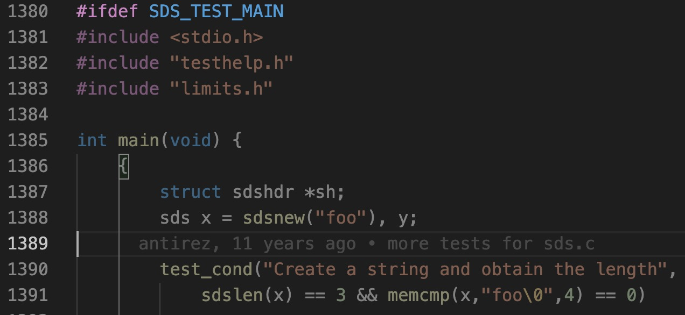

## redis string 阅读笔记

redis 是 key-value 型数据库，其中 value 的数据类型有：string、hash、list、set、zset 五种。

此文档是读 string 读实现，即 sds.h 和 sds.c 两个文件。

### 1. 从宏观看 string 类型的底层结构 SDS(Simple Dynamic String)

redis 中需要用到可修改的/可变的字符串的地方，都是用它自己封装的 sds 类型。

以下是 sds 的结构定义源码：

```c
struct sdshdr {
    // buf 中已占用空间的长度
    int len;

    // buf 中剩余可用空间的长度
    int free;

    // 数据空间，在这里存放字符串
    char buf[];
};
```

其实就是封装了一下 c 语言原来的字符串，在原来的字符串基础上添加了长度属性和可用空间长度的属性。

#### redis 封装的特点：

* buf 字段沿用了 c 语言的字符串形式

  这样的好处是可以沿用部分 c标准库函数，比如 `printf`，不用自己写

  redis api 自动在 buf 后面加上 '\0' 并且不计入 len 字段。这个对用户是完全透明的

* 常数时间复杂度获取字符串长度，不用遍历

  其实这样的做法还是挺常见的。比如 java 的 ArrayList，也会有一个私有成员 size 来存储大小。像许多支持动态数组的高级语言都会这么做，每次扩容就不用再去遍历查长度了。

  而且学数据结构肯定也这么写过，写链表的时候都会下意识的加个长度字段吧？

  > ps: 平时开发我们肯定是喜欢用语言层面提供的封装好的动态数组，但是有时候我们也会希望自己封装，这时候 c 语言 的另一个特点就体现出来了，它给你提供基本的接口，其他的可以自己去实现。

* 向外提供的接口是安全的

  说简单点就是自动扩容，接口的操作不会造成数组溢出。

  我认为这是基本要求，封装的完整性。

* 减少修改字符串带来的开销

  sds 有 free 字段，标志了还有多少个位置可以用。

  下面就提一下 redis 空间分配的策略：

  * 空间预分配策略

    如果对 sds 扩容后，sds 长度小于 1mb，那么程序分配和 len 属性同样大小的未使用空间。

    如果对 sds 扩容后，sds 长度大于 1mb，那么程序分配 1mb 未使用空间。

    就是这个 sds 本来有预留空间，现在预留空间满了，那么要再次分配时，就在满足填入字符串的基础上再预分配。

  * 惰性释放策略

    sds 截掉后面一部分的字符，直接修改 len 和 free 字段，并且在修改后的 len 索引位置改成`\0`

    后面的字符删了，但没完全删。这样下次增加字符的时候，就可以复用。

    > 书中写有接口能释放掉，所以不用担心空着的容量一直占着位置

  空间分配策略的核心思想就是要减少扩容和缩容的次数，即减少内存重新分配的次数。因为重新分配要系统调用，系统调用相对来说是比较慢的。这样增加 n 次字符串长度，从最开始的至少 O(n) 降低为至多 O(n)

  > 从这里可以窥见 redis 注重效率和性能的特点，之后还会在很多地方看见，总是在各种地方给你抠细节

* 二进制安全

  虽然 redis 的 buf 字段是沿用 c 语言的，但是并没有完全用。

  我们知道 c 语言字符串以 `'\0'` 结尾，这样就不能识别空字符在字符串中间的情况。例如图片和二进制流

  但 redis 是数据库，还是有这方面的存储需求的。

   redis 可以用 len 字段来确定字符串的长度，对于二进制流来说，直接用 len 输出就可以了，不用考虑内部是什么样子的。

### 2. 从源码看 redis 的 SDS

#### 2.1 sds.h

sds.h 31行前全是注释，然后可以

待续...

### 精彩之处

* `#ifdef`测试

  c 语言开发工程的时候，可以在写好的模块里面添加测试。

  redis 这里用到了预处 `#ifdef`

  

  `#ifdef` 表示检查宏是否有定义，定义了才执行

  gcc 编译的时候，通过执行 `gcc -DSDS_TEST_MAIN` 来定义宏。

  这样就能编译出测试程序。

  还可以根据 `#ifdef` 来判断是 windows 还是 linux 系统，不同的系统不同的处理，从而提高代码的移植性。

  > ps: 有专门的 windows 和 linux 宏来判断系统。

* `#ifndef`

  这个预处理指令表示 if no define，即如果没有定义某个宏，则执行。。。

  需要和 `#endif` 一起使用。

  其实这种 if 和 endif 写法挺常见的，软件工程里面结构化语言也是这样

   

   

  可以看见 sds.h 的文件下，开头是 ifndef 起始，后面是 endif 结尾

  31行前都是注释

* <string.h>/strcat 函数

  C 库函数 strcat 把 **src** 所指向的字符串追加到 **dest** 所指向的字符串的结尾。

  ```c
  char *strcat(char *dest, const char *src)
  ```

  返回一个指向 dest 指向原字符串的指针

  这个函数可能会溢出

* <string.h>/strcasecmp 函数

  用来比较参数s1 和s2 字符串，比较时会自动忽略大小写的差异。

  ```c
  int strcasecmp (const char *s1, const char *s2
  ```

  若参数s1 和s2 字符串相同则返回0。s1 长度大于s2 长度则返回大于0 的值，s1 长度若小于s2 长度则返回小于0 的值。

* <sys/types.h>

  是Unix/Linux系统的基本系统数据类型的头文件，含有size_t，time_t，pid_t等类型。

  https://blog.csdn.net/robinblog/article/details/6262152

* <stdarg.h>

  std arg 标准参数库，可以用来声明参数不定的函数

  https://zh.wikipedia.org/wiki/Stdarg.h

* static inline

  就是编译的时候把函数内联到函数调用的地方，这是为了提高执行效率，不经过函数调用的耗时。太长的函数就算写了 inline ，编译器也不会这么做。

  但是 inline 函数不一定会内联，当放到头文件，希望多个文件共用的时候，那么可能会出现函数重复定义的情况。所以要加 static，可以让它内联。

  https://stackoverflow.com/questions/31108159/what-is-the-use-of-the-inline-keyword-in-c/31108614

  https://blog.csdn.net/huanghui167/article/details/41346663

* size_t

  typedef unsigned long size_t

  This type is used to represent the size of an object. 

  https://stackoverflow.com/questions/2550774/what-is-size-t-in-c

  