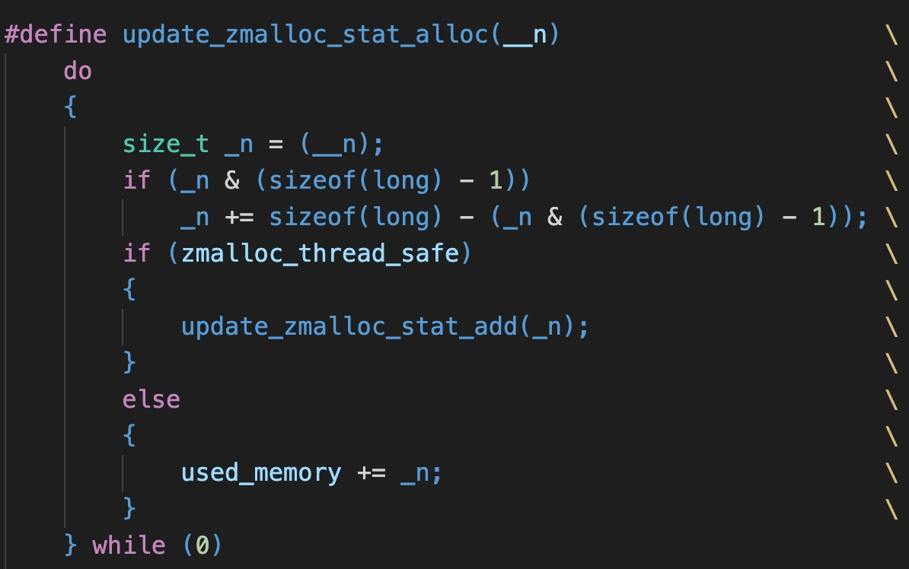

## 内存管理

### 引言

在开始看 redis 内存管理之前，有必要对 c 语言的知识进行补全。

* 字节对齐

  在做内存管理的时候，需要引入**字节对齐的概念**

  根据操作系统的字长不同，又可以分为 8 字节对齐和 4 字节对齐。意思每个分配内存第一个字节地址是 8 的倍数（4字节对齐是 4 的倍数）。目的是为了提高计算机读取数据的效率，具体原理如下：

  > CPU一次性能读取数据的二进制位数称为字长，也就是我们通常所说的32位系统（字长4个字节）、64位系统（字长8个字节）的由来。所谓的8字节对齐，就是指变量的起始地址是8的倍数。比如程序运行时（CPU）在读取long型数据的时候，只需要一个总线周期，时间更短，如果不是8字节对齐的则需要两个总线周期才能读完数据。
  >
  > 8字节对齐是针对64位系统而言的，如果是32位系统那么就是4字节对齐。实际上Redis源码中的字节对齐是软编码，而非硬编码。里面多用sizeof(long)或sizeof(size_t)来表示。size_t（gcc中其值为long unsigned int）和long的长度是一样的，long的长度就是计算机的字长。这样在未来的系统中如果字长（long的大小）不是8个字节了，该段代码依然能保证相应代码可用。
  >
  > 出自 ---- https://blog.csdn.net/guodongxiaren/article/details/44747719

  c 语言的标准库函数 malloc 已经实现了字节对齐，对于刚好分不到8倍数的情况，会多分配，而这部分多分配的内存对用户是隐藏的。而 redis 内存管理 zmalloc 所做的，就是感知这部分的内存。

  就像作者注释所说的：

  **zmalloc - total amount of allocated memory aware version of malloc()**

* 宏函数

  问就是之前没用过，而且 redis 里面写了一堆。

  

  严格来说这不是函数，只是长得像函数。

  它其实是个宏，用 define 去定义。c 语言里面的宏在预处理阶段会去替换源代码，不会参加编译。也就是说，这里写的一个代码片段，最后在编译前会**自动插入到源码中写了 `update_zmalloc_stat_alloc()`的地方**。不会经过编译，也不会有函数调用。

  不经过函数调用就能提升效率。

  别问为什么不直接写在代码里？减少没必要的重复劳动。

  * 为什么每行结尾都有 `\`?

    因为这是个宏定义，宏定义要求一个定义名后面跟着一个字符串。预处理的时候，会把字符串插入源码代替这个宏。所以后面那个函数体需要是字符串。而 c 语言里面字符串不能换行，但是加个`\`就可以在预处理的时候，忽略后面的换行符，看成是一行的字符串。

  * 为什么会有 do while(0)？

    看起来没什么用，其实还是有用的。

    这是因为后面的函数体作为字符串插入到源码的时候，可能会造成缩进有问题，如果刚好是在一个没有打括号的 if 语句里面，就会有错误了。

    加一个 do while 就是为了防止这类问题的产生。

    具体看：https://www.pixelstech.net/article/1390482950-do-%7B-%7D-while-%280%29-in-macros

    或者自己查，这个还挺容易查到的。

* 函数指针

  字面意思，指向函数入口地址的指针。

  可以用来进行函数的传参。所以用 go 的 gin 框架写 web 服务的时候，handler 是传函数进去的也不用大惊小怪，c 语言就有了。😊

### 源码

《redis 设计与实现》没有这部分的说明，有个博主写的文章很不错，可以参考：https://guodong.blog.csdn.net/article/details/44810325

关于几个宏定义，适配平台的，可以看这里：https://www.bbsmax.com/A/kPzOrRlwdx/

...待续

### 参考

* https://blog.csdn.net/guodongxiaren/article/details/44747719