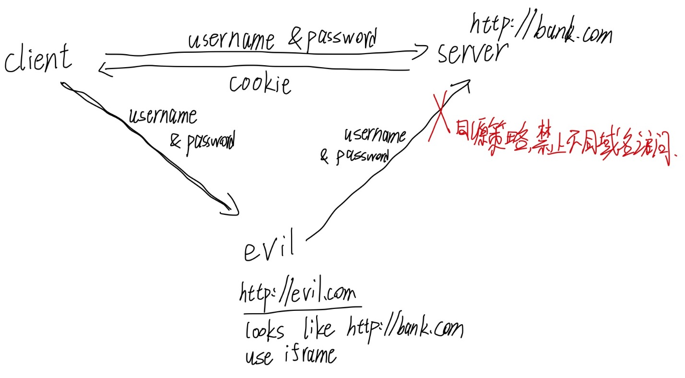
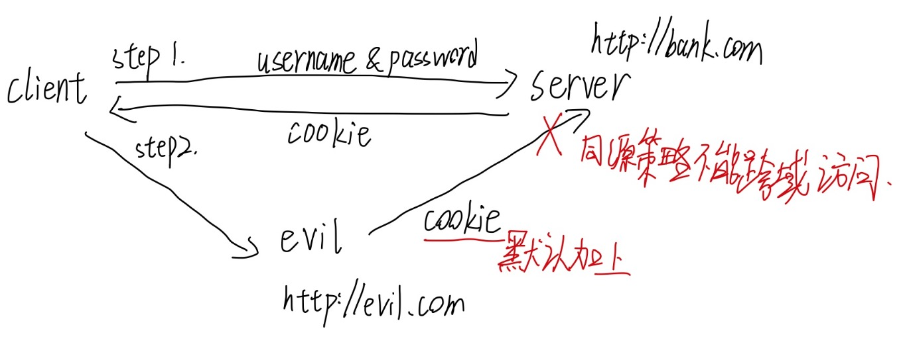

## 从同源策略展开

同源策略是浏览器的安全保护机制。简单概括就是不允许在一个域名下的脚本（前端一般用的 JavaScript ）去访问不同域的接口/页面。

### 同源策略作用

#### 防止 DOM 跨域访问

如果有人用 iframe（HTML标签） 访问了银行页面，然后经过适当的调整，整个页面看起来就和银行原来的页面一模一样了，只有域名不一样。然后你在这个恶意页面上输入账号密码登陆，会直接访问银行的后端接口。这样账号密码就泄漏了。

> 我亲身经历：访问了一个教师资格证的钓鱼网站，输入了自己的微信，点注册发现什么事情都没发生。过了一会有个人自称是教师资格证老师加我微信，wtm马上就知道是骗子了。
>
> 这件事情我要感谢 chrome 浏览器有同源策略。这个钓鱼网站是他们自己写的而不是用 iframe 直接调官方的，不然损失就大了。
>
> 我还要感谢 tmd 百度搜索，搜索 “教师资格证” 第一个出来的竟然不是官网而是钓鱼网站。呵呵，百度什么黑心公司，差不多得了。

#### 防止跨站请求伪造 （CSRF）

这是另外一个种攻击手段。你可能登陆过了银行网站，拿到了一个 cookie。

这时候你去访问了一个恶意网站，这个网站可能是按钮你点了/又或者是进去就自动访问了银行的后端接口，并且是用 post 请求。

这时候浏览器会默认带上你之前从银行登录那边拿到的 cookie ，并且正常返回 response。数据就泄漏了。

**由此可见，cookie 是不安全的，因为在访问一个网站时，会自动带上此网站的 cookie。**

**而我们平常用的 token，是开发者自己定义实现的，不会被默认带上，它可以有效解决 跨域请求伪造攻击，它比 cookie 安全。**

### 如何跨域

上面讲完了为什么不能跨域，但是我们在开发中很可能会遇到要跨域的情况。

举个例子，前后端分离。前后端就是两个域，这时再访问就会有跨域的问题了。

解决办法有下面几种：

* CORS（跨域资源共享）

  这是 http 协议的一部分。通过前端加上请求头 `Origin: http://www.frontend.com`

  然后后端对这个 origin 进行判断，再返回响应头 `Access-Control-Allow-Origin：http://www.frontend.com`（响应头有一组的，这里只列出一个举例）

  从而告诉浏览器允许跨域。

  **注意，后端必须对 origin 判断，如果不判断直接返回字段是 *，是不安全的，但是这样也能跨域（部分浏览器不行）**

* JSONP 跨域

  `script` 标签不受浏览器同源策略的影响，允许跨域引用资源。因此可以通过动态创建 script 标签，然后利用 src 属性进行跨域。

  但是这种方法只支持 get 请求，而且不是很安全。

* 图像 Ping 跨域

  `img` 标签不受浏览器同源策略的影响，允许跨域引用资源。因此可以通过 img 标签的 src 属性进行跨域。

* **代理**

  这是最好的方法。我们团队的项目也是走 nginx 的代理。浏览器有跨域限制，但是服务器不存在跨域问题，所以可以由服务器请求所有域的资源再返回给客户端。代理是万能的。

### 参考：

* https://juejin.cn/post/6844903681683357710
* https://developer.mozilla.org/zh-CN/docs/Web/Security/Same-origin_policy
* https://zh.wikipedia.org/wiki/%E8%B7%A8%E4%BE%86%E6%BA%90%E8%B3%87%E6%BA%90%E5%85%B1%E4%BA%AB
* https://zh.wikipedia.org/wiki/%E8%B7%A8%E7%B6%B2%E7%AB%99%E6%8C%87%E4%BB%A4%E7%A2%BC
* https://zh.wikipedia.org/wiki/%E5%90%8C%E6%BA%90%E7%AD%96%E7%95%A5